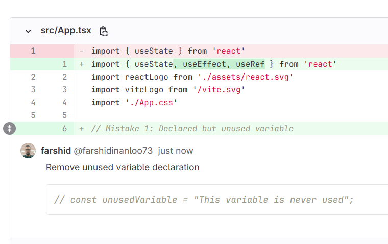

# 🔍 GPT-GitLab Code Review Assistant (Chrome Extension)

A lightweight Chrome extension that connects to **GitLab API** and **OpenAI GPT API** to assist with reviewing **Merge Requests** more efficiently and intelligently.

## ✨ Features

- 🔗 Connects directly to your GitLab Merge Requests
- 🤖 Uses GPT to review and suggest improvements in code
- ⏱ Saves time by summarizing and analyzing code changes
- 💬 Generates smart comments for MR discussions
- 🧪 Lightweight and easy to set up

## 📸 Screenshots

## 🚀 Getting Started

### Prerequisites

- A GitLab account with API access
- Aval AI API key (for GPT access)
- Google Chrome

### Installation

1. Clone the repository
2. pnpm i
3. pnpm build

## How to use:

1. navigate to this address in chrome: **chrome://extensions/**
2. enable **Developer mode** in top right corner
3. click on **Load unpacked** button
4. upload dist folder.
